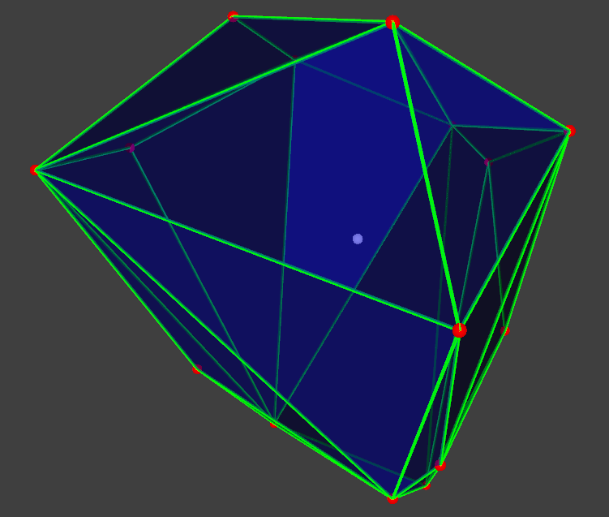

# Vertex Enumeration 3D
__VertexEnumeration3D__ is an efficient tool to enumerate all vertices of a 3D polytope.

# Feature

1. Only [3 header files](https://github.com/ZJU-FAST-Lab/VertexEnumeration3D/tree/master/include/geoutils) are all you needed.

2. This tool is more efficient and robust than [__cddlib__](https://github.com/cddlib/cddlib) for 3D polytopes.

3. Any __nonzero-volume__ polytope is acceptable even with __degenrate vertices__(one shared by more than 3 facets).

4. An order of magnitude faster than cddlib by leveraging __polar duality__ and mature convex hull algorithms.

# Interface

Only one function is needed.

     bool geoutils::enumerateVs(const Eigen::MatrixX4d &hPoly, 
                                Eigen::MatrixXd &vPoly);

Inputs:

    hPoly: 
        An Eigen matrix with size N*4. N is the number of halfspaces. The i-th row 
        is (h0, h1, h2, h3) defining a halfspace as h0*x + h1*y + h2*z + h3 <= 0.

        A 3D polytope is defined by the halfspace intersection, thus an arbitrary 
        number of redundant halfspaces is acceptable.

Outputs:

    vPoly:
        An Eigen matrix with size 3*M. M is the number of vertices.

Example: [src/polyve.cpp](https://github.com/ZJU-FAST-Lab/VertexEnumeration3D/blob/master/src/polyve.cpp).

If an interior point of the polytope is already known, the following function can be used instead.

    void enumerateVs(const Eigen::MatrixX4d &hPoly, 
                     const Eigen::Vector3d &inner, 
                     Eigen::MatrixXd &vPoly)

# Results

  

The ground-truth polytope is visualized by blue facets with green edges. The white sphere is an interior point automatically found by the tool. The red spheres are enumerated vertices, which are consistent with the ground truth.
